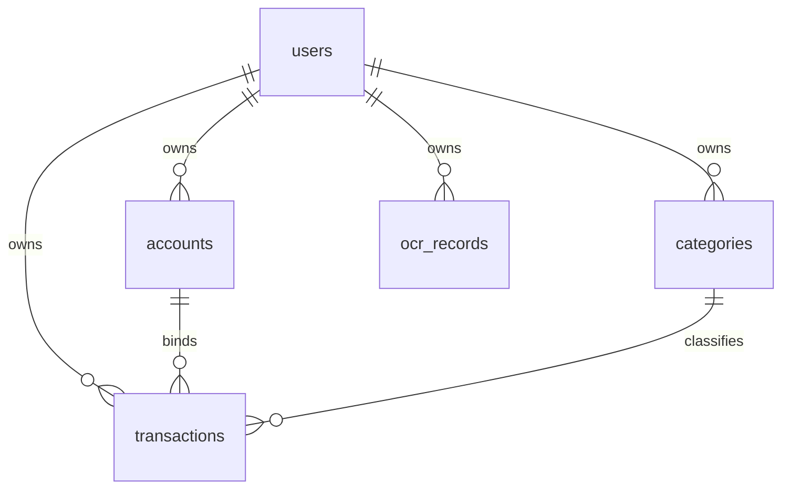
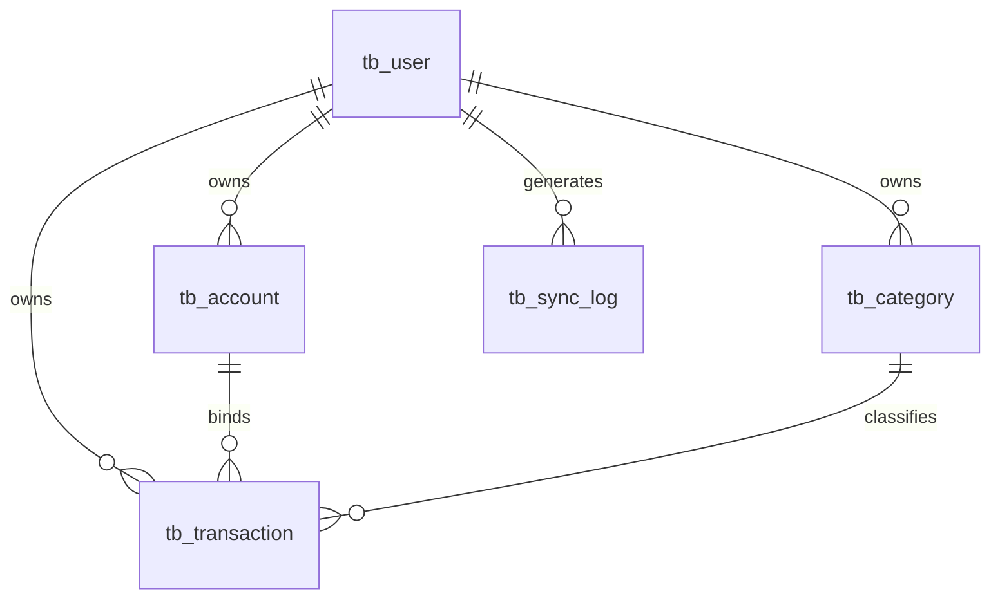

# 小记OCR记账数据库设计说明

## 1. 说明

本文档基于当前项目源码整理，分为两部分：

- 客户端本地数据库：对应 Android `Room` 实际实体结构，是当前运行中的真实本地库设计。
- 后端持久化数据库：对应当前 Spring Boot 演示后端的数据模型，给出适合落 MySQL 的推荐表结构、关系与约束。

需要特别说明的是，当前后端源码仍使用 `DemoStore` 内存结构，并未真正接入 MySQL。下面的“后端表结构”属于与现有代码语义一致的推荐持久化设计，适合你后续真正建表时使用。

## 2. 设计原则

### 2.1 本地库设计原则

- 以离线可用为第一目标。
- 允许少量冗余字段，减少联表和同步复杂度。
- 保留同步状态字段，支持本地优先策略。
- 保留 OCR 历史和同步队列，服务端无需感知。

### 2.2 后端库设计原则

- 尽量遵守规范化设计。
- 交易表只保存交易本身和必要外键，不把账户信息、用户信息整块重复塞进交易表。
- 用户、账户、分类、交易分表管理。
- 使用主键、外键、唯一约束、检查约束保证数据一致性。

## 3. 当前客户端 Room 本地库

## 3.1 表清单

当前 Android 本地库 `AppDatabase` 包含 6 张表：

- `users`
- `accounts`
- `categories`
- `transactions`
- `ocr_records`
- `sync_operations`

## 3.2 表结构

### 3.2.1 `users`

用途：保存当前已登录用户的本地资料快照。

| 字段名 | 类型 | 是否主键 | 是否可空 | 说明 |
| --- | --- | --- | --- | --- |
| id | INTEGER / Long | 是 | 否 | 用户 ID |
| username | TEXT | 否 | 否 | 用户名 |
| nickname | TEXT | 否 | 是 | 昵称 |
| email | TEXT | 否 | 是 | 邮箱 |
| phone | TEXT | 否 | 是 | 手机号 |
| createdAt | INTEGER / Long | 否 | 否 | 创建时间 |
| updatedAt | INTEGER / Long | 否 | 否 | 更新时间 |

建议约束：

- `PRIMARY KEY (id)`
- `username` 在本地通常只保存当前登录用户快照，不强制唯一也能工作，但推荐逻辑上唯一

### 3.2.2 `accounts`

用途：保存用户的资金账户，如现金、微信、支付宝、银行卡。

| 字段名 | 类型 | 是否主键 | 是否可空 | 说明 |
| --- | --- | --- | --- | --- |
| id | INTEGER / Long | 是 | 否 | 账户 ID |
| userId | INTEGER / Long | 否 | 否 | 所属用户 |
| name | TEXT | 否 | 否 | 账户名称 |
| symbol | TEXT | 否 | 否 | 账户图标字符/标识 |
| balanceFen | INTEGER / Long | 否 | 否 | 账户余额，单位分 |
| isDefault | INTEGER / Boolean | 否 | 否 | 是否默认账户 |
| createdAt | INTEGER / Long | 否 | 否 | 创建时间 |
| updatedAt | INTEGER / Long | 否 | 否 | 更新时间 |

建议约束：

- `PRIMARY KEY (id)`
- `userId` 逻辑上关联 `users.id`
- 同一用户下账户名称唯一：`UNIQUE(userId, name)`

### 3.2.3 `categories`

用途：保存收入/支出分类。

| 字段名 | 类型 | 是否主键 | 是否可空 | 说明 |
| --- | --- | --- | --- | --- |
| id | INTEGER / Long | 是 | 否 | 分类 ID |
| userId | INTEGER / Long | 否 | 否 | 所属用户 |
| name | TEXT | 否 | 否 | 分类名称 |
| type | TEXT / Enum | 否 | 否 | `INCOME` 或 `EXPENSE` |
| icon | TEXT | 否 | 是 | 图标标识 |
| color | TEXT | 否 | 是 | 颜色值 |
| isDefault | INTEGER / Boolean | 否 | 否 | 是否默认分类 |
| createdAt | INTEGER / Long | 否 | 否 | 创建时间 |
| updatedAt | INTEGER / Long | 否 | 否 | 更新时间 |
| syncStatus | TEXT / Enum | 否 | 否 | 同步状态 |

建议约束：

- `PRIMARY KEY (id)`
- 同一用户同一类型下分类名称唯一：`UNIQUE(userId, type, name)`
- `CHECK (type IN ('INCOME', 'EXPENSE'))`

### 3.2.4 `transactions`

用途：保存交易记录，是账本核心表。

| 字段名 | 类型 | 是否主键 | 是否可空 | 说明 |
| --- | --- | --- | --- | --- |
| id | INTEGER / Long | 是 | 否 | 交易 ID |
| userId | INTEGER / Long | 否 | 否 | 所属用户 |
| type | TEXT / Enum | 否 | 否 | `INCOME` 或 `EXPENSE` |
| amountFen | INTEGER / Long | 否 | 否 | 金额，单位分 |
| accountId | INTEGER / Long | 否 | 是 | 关联账户 ID |
| accountName | TEXT | 否 | 是 | 账户名称快照 |
| categoryId | INTEGER / Long | 否 | 否 | 分类 ID |
| categoryName | TEXT | 否 | 否 | 分类名称快照 |
| remark | TEXT | 否 | 是 | 备注 |
| merchantName | TEXT | 否 | 是 | 商户名称 |
| transactionTime | INTEGER / Long | 否 | 否 | 交易发生时间 |
| source | TEXT / Enum | 否 | 否 | `MANUAL` 或 `OCR` |
| createdAt | INTEGER / Long | 否 | 否 | 创建时间 |
| updatedAt | INTEGER / Long | 否 | 否 | 更新时间 |
| syncStatus | TEXT / Enum | 否 | 否 | 同步状态 |

注意：

- `accountName` 和 `categoryName` 是快照冗余字段。
- 这样做是为了减少联表复杂度，适合本地展示和同步。
- 对于严格规范化数据库设计，后端不建议长期保留这两个冗余字段作为真值字段。

建议约束：

- `PRIMARY KEY (id)`
- `CHECK (type IN ('INCOME', 'EXPENSE'))`
- `CHECK (source IN ('MANUAL', 'OCR'))`
- `CHECK (amountFen >= 0)`
- `userId` 逻辑关联 `users.id`
- `categoryId` 逻辑关联 `categories.id`
- `accountId` 逻辑关联 `accounts.id`

### 3.2.5 `ocr_records`

用途：保存 OCR 识别历史，仅本地使用。

| 字段名 | 类型 | 是否主键 | 是否可空 | 说明 |
| --- | --- | --- | --- | --- |
| id | INTEGER / Long | 是 | 否 | OCR 历史 ID |
| userId | INTEGER / Long | 否 | 否 | 所属用户 |
| imageUri | TEXT | 否 | 否 | 图片路径 |
| amountText | TEXT | 否 | 是 | 金额原始文本 |
| amountFen | INTEGER / Long | 否 | 是 | 金额分值 |
| dateText | TEXT | 否 | 是 | 日期文本 |
| merchantName | TEXT | 否 | 是 | 商户名称 |
| rawJson | TEXT | 否 | 是 | 原始 OCR 文本 |
| createdAt | INTEGER / Long | 否 | 否 | 创建时间 |

建议约束：

- `PRIMARY KEY (id)`
- `userId` 逻辑关联 `users.id`

### 3.2.6 `sync_operations`

用途：记录本地待同步操作队列。

| 字段名 | 类型 | 是否主键 | 是否可空 | 说明 |
| --- | --- | --- | --- | --- |
| id | INTEGER / Long | 是 | 否 | 自增主键 |
| entityType | TEXT / Enum | 否 | 否 | `ACCOUNT`、`CATEGORY`、`TRANSACTION` |
| entityId | INTEGER / Long | 否 | 否 | 目标实体 ID |
| operationType | TEXT / Enum | 否 | 否 | `CREATE`、`UPDATE`、`DELETE` |
| payloadJson | TEXT | 否 | 是 | 快照 JSON |
| createdAt | INTEGER / Long | 否 | 否 | 创建时间 |
| retryCount | INTEGER / Int | 否 | 否 | 重试次数 |

建议约束：

- `PRIMARY KEY (id AUTOINCREMENT)`
- `CHECK (entityType IN ('ACCOUNT', 'CATEGORY', 'TRANSACTION'))`
- `CHECK (operationType IN ('CREATE', 'UPDATE', 'DELETE'))`
- `CHECK (retryCount >= 0)`

## 3.3 本地库关系图



## 3.4 本地库关键约束总结

- 一个用户可拥有多个账户。
- 一个用户可拥有多个分类。
- 一个用户可拥有多条交易。
- 一条交易必须绑定一个分类。
- 一条交易可以不绑定账户。
- OCR 历史仅归属于用户，不参与同步。
- 同步队列不直接做外键绑定，因为它本质上是“变更日志”。

## 4. 后端推荐 MySQL 持久化设计

## 4.1 为什么要单独给后端推荐一套表

当前本地 Room 表为方便展示和同步，保留了一些快照字段，例如：

- `transactions.accountName`
- `transactions.categoryName`

这些字段在客户端是合理的，因为可以减少联表和断网时的展示成本。  
但如果你要把后端真的改成 MySQL，推荐后端数据库尽量按规范化设计，只保留外键，把名称类字段放在对应主表里维护。这样后端结构更干净，也更符合你之前提到的“交易表不应该包含账户相关和用户相关冗余信息”的要求。

## 4.2 后端核心表清单

推荐后端至少使用以下 5 张表：

- `tb_user`
- `tb_account`
- `tb_category`
- `tb_transaction`
- `tb_sync_log`（可选，用于调试同步）

说明：

- `tb_sync_log` 不是业务必须表，只是如果你想做同步审计会很方便。
- OCR 不建议在后端建表，因为你当前项目设定里 OCR 历史不参与云端同步。

## 4.3 后端表结构

### 4.3.1 `tb_user`

用途：保存系统用户信息。

| 字段名 | MySQL 类型 | 是否主键 | 是否可空 | 约束/说明 |
| --- | --- | --- | --- | --- |
| id | BIGINT | 是 | 否 | 主键 |
| username | VARCHAR(64) | 否 | 否 | 用户名，唯一 |
| password_hash | VARCHAR(255) | 否 | 否 | BCrypt 密码哈希 |
| nickname | VARCHAR(64) | 否 | 是 | 昵称 |
| email | VARCHAR(128) | 否 | 是 | 邮箱 |
| phone | VARCHAR(32) | 否 | 是 | 手机号 |
| created_at | BIGINT | 否 | 否 | 创建时间戳 |
| updated_at | BIGINT | 否 | 否 | 更新时间戳 |

推荐约束：

- `PRIMARY KEY (id)`
- `UNIQUE KEY uk_user_username (username)`

### 4.3.2 `tb_account`

用途：保存用户的资金账户。

| 字段名 | MySQL 类型 | 是否主键 | 是否可空 | 约束/说明 |
| --- | --- | --- | --- | --- |
| id | BIGINT | 是 | 否 | 主键 |
| user_id | BIGINT | 否 | 否 | 所属用户 |
| name | VARCHAR(64) | 否 | 否 | 账户名称 |
| symbol | VARCHAR(32) | 否 | 否 | 图标标识 |
| balance_fen | BIGINT | 否 | 否 | 当前余额，单位分 |
| is_default | TINYINT(1) | 否 | 否 | 是否默认账户 |
| created_at | BIGINT | 否 | 否 | 创建时间戳 |
| updated_at | BIGINT | 否 | 否 | 更新时间戳 |

推荐约束：

- `PRIMARY KEY (id)`
- `FOREIGN KEY (user_id) REFERENCES tb_user(id)`
- `UNIQUE KEY uk_account_user_name (user_id, name)`
- `CHECK (balance_fen >= 0)` 可选，若允许透支可去掉

### 4.3.3 `tb_category`

用途：保存用户的分类信息。

| 字段名 | MySQL 类型 | 是否主键 | 是否可空 | 约束/说明 |
| --- | --- | --- | --- | --- |
| id | BIGINT | 是 | 否 | 主键 |
| user_id | BIGINT | 否 | 否 | 所属用户 |
| name | VARCHAR(64) | 否 | 否 | 分类名称 |
| type | VARCHAR(16) | 否 | 否 | `INCOME` / `EXPENSE` |
| icon | VARCHAR(64) | 否 | 是 | 图标标识 |
| color | VARCHAR(16) | 否 | 是 | 颜色值 |
| is_default | TINYINT(1) | 否 | 否 | 是否默认分类 |
| created_at | BIGINT | 否 | 否 | 创建时间戳 |
| updated_at | BIGINT | 否 | 否 | 更新时间戳 |

推荐约束：

- `PRIMARY KEY (id)`
- `FOREIGN KEY (user_id) REFERENCES tb_user(id)`
- `UNIQUE KEY uk_category_user_type_name (user_id, type, name)`
- `CHECK (type IN ('INCOME', 'EXPENSE'))`

### 4.3.4 `tb_transaction`

用途：保存交易记录，是后端核心业务表。

| 字段名 | MySQL 类型 | 是否主键 | 是否可空 | 约束/说明 |
| --- | --- | --- | --- | --- |
| id | BIGINT | 是 | 否 | 主键 |
| user_id | BIGINT | 否 | 否 | 所属用户 |
| type | VARCHAR(16) | 否 | 否 | `INCOME` / `EXPENSE` |
| amount_fen | BIGINT | 否 | 否 | 金额，单位分 |
| account_id | BIGINT | 否 | 是 | 关联账户 ID，可空 |
| category_id | BIGINT | 否 | 否 | 关联分类 ID |
| remark | VARCHAR(255) | 否 | 是 | 备注 |
| merchant_name | VARCHAR(128) | 否 | 是 | 商户名称 |
| transaction_time | BIGINT | 否 | 否 | 交易时间戳 |
| source | VARCHAR(16) | 否 | 否 | `MANUAL` / `OCR` |
| created_at | BIGINT | 否 | 否 | 创建时间戳 |
| updated_at | BIGINT | 否 | 否 | 更新时间戳 |

推荐约束：

- `PRIMARY KEY (id)`
- `FOREIGN KEY (user_id) REFERENCES tb_user(id)`
- `FOREIGN KEY (account_id) REFERENCES tb_account(id) ON DELETE SET NULL`
- `FOREIGN KEY (category_id) REFERENCES tb_category(id)`
- `CHECK (type IN ('INCOME', 'EXPENSE'))`
- `CHECK (source IN ('MANUAL', 'OCR'))`
- `CHECK (amount_fen >= 0)`

这里要特别强调：

- 后端推荐表 `tb_transaction` 不再保存 `account_name`、`category_name`、`username` 这类冗余字段。
- 用户信息从 `tb_user` 查。
- 账户信息从 `tb_account` 查。
- 分类信息从 `tb_category` 查。

这正符合你说的“数据库之间应该是表与表之间相连，需要时再读其他表，每个表只有自己的相关内容”。

### 4.3.5 `tb_sync_log`（可选）

用途：记录同步过程，便于调试或后台排错。

| 字段名 | MySQL 类型 | 是否主键 | 是否可空 | 约束/说明 |
| --- | --- | --- | --- | --- |
| id | BIGINT | 是 | 否 | 主键 |
| user_id | BIGINT | 否 | 否 | 所属用户 |
| entity_type | VARCHAR(32) | 否 | 否 | 账户/分类/交易 |
| entity_id | BIGINT | 否 | 否 | 实体 ID |
| operation_type | VARCHAR(16) | 否 | 否 | create/update/delete/pull |
| payload_json | TEXT | 否 | 是 | 变更快照 |
| created_at | BIGINT | 否 | 否 | 创建时间戳 |

推荐约束：

- `PRIMARY KEY (id)`
- `FOREIGN KEY (user_id) REFERENCES tb_user(id)`

## 4.4 后端表关系图



## 4.5 推荐 MySQL 建表 SQL

```sql
CREATE TABLE tb_user (
    id BIGINT PRIMARY KEY,
    username VARCHAR(64) NOT NULL,
    password_hash VARCHAR(255) NOT NULL,
    nickname VARCHAR(64) NULL,
    email VARCHAR(128) NULL,
    phone VARCHAR(32) NULL,
    created_at BIGINT NOT NULL,
    updated_at BIGINT NOT NULL,
    CONSTRAINT uk_user_username UNIQUE (username)
) ENGINE=InnoDB DEFAULT CHARSET=utf8mb4;

CREATE TABLE tb_account (
    id BIGINT PRIMARY KEY,
    user_id BIGINT NOT NULL,
    name VARCHAR(64) NOT NULL,
    symbol VARCHAR(32) NOT NULL,
    balance_fen BIGINT NOT NULL DEFAULT 0,
    is_default TINYINT(1) NOT NULL DEFAULT 0,
    created_at BIGINT NOT NULL,
    updated_at BIGINT NOT NULL,
    CONSTRAINT fk_account_user FOREIGN KEY (user_id) REFERENCES tb_user(id),
    CONSTRAINT uk_account_user_name UNIQUE (user_id, name)
) ENGINE=InnoDB DEFAULT CHARSET=utf8mb4;

CREATE TABLE tb_category (
    id BIGINT PRIMARY KEY,
    user_id BIGINT NOT NULL,
    name VARCHAR(64) NOT NULL,
    type VARCHAR(16) NOT NULL,
    icon VARCHAR(64) NULL,
    color VARCHAR(16) NULL,
    is_default TINYINT(1) NOT NULL DEFAULT 0,
    created_at BIGINT NOT NULL,
    updated_at BIGINT NOT NULL,
    CONSTRAINT fk_category_user FOREIGN KEY (user_id) REFERENCES tb_user(id),
    CONSTRAINT uk_category_user_type_name UNIQUE (user_id, type, name),
    CONSTRAINT ck_category_type CHECK (type IN ('INCOME', 'EXPENSE'))
) ENGINE=InnoDB DEFAULT CHARSET=utf8mb4;

CREATE TABLE tb_transaction (
    id BIGINT PRIMARY KEY,
    user_id BIGINT NOT NULL,
    type VARCHAR(16) NOT NULL,
    amount_fen BIGINT NOT NULL,
    account_id BIGINT NULL,
    category_id BIGINT NOT NULL,
    remark VARCHAR(255) NULL,
    merchant_name VARCHAR(128) NULL,
    transaction_time BIGINT NOT NULL,
    source VARCHAR(16) NOT NULL,
    created_at BIGINT NOT NULL,
    updated_at BIGINT NOT NULL,
    CONSTRAINT fk_transaction_user FOREIGN KEY (user_id) REFERENCES tb_user(id),
    CONSTRAINT fk_transaction_account FOREIGN KEY (account_id) REFERENCES tb_account(id) ON DELETE SET NULL,
    CONSTRAINT fk_transaction_category FOREIGN KEY (category_id) REFERENCES tb_category(id),
    CONSTRAINT ck_transaction_type CHECK (type IN ('INCOME', 'EXPENSE')),
    CONSTRAINT ck_transaction_source CHECK (source IN ('MANUAL', 'OCR')),
    CONSTRAINT ck_transaction_amount CHECK (amount_fen >= 0)
) ENGINE=InnoDB DEFAULT CHARSET=utf8mb4;

CREATE TABLE tb_sync_log (
    id BIGINT PRIMARY KEY,
    user_id BIGINT NOT NULL,
    entity_type VARCHAR(32) NOT NULL,
    entity_id BIGINT NOT NULL,
    operation_type VARCHAR(16) NOT NULL,
    payload_json TEXT NULL,
    created_at BIGINT NOT NULL,
    CONSTRAINT fk_sync_log_user FOREIGN KEY (user_id) REFERENCES tb_user(id)
) ENGINE=InnoDB DEFAULT CHARSET=utf8mb4;
```

## 5. 哪些字段应该删，哪些字段应该保留

如果你在论文或数据库设计图里展示“后端规范化数据库”，我建议这样处理：

### 5.1 后端交易表应保留

- `id`
- `user_id`
- `type`
- `amount_fen`
- `account_id`
- `category_id`
- `remark`
- `merchant_name`
- `transaction_time`
- `source`
- `created_at`
- `updated_at`

### 5.2 后端交易表不建议保留

- `account_name`
- `category_name`
- `username`
- `nickname`
- 任何账户余额字段
- 任何分类颜色字段

原因：

- 账户名称属于账户表。
- 分类名称属于分类表。
- 用户名属于用户表。
- 余额属于账户汇总结果，不应冗余到交易表。

### 5.3 客户端本地表为什么还保留 `accountName` 和 `categoryName`

因为客户端当前实现采用“本地优先 + 快照展示 + 简化同步”的思路，所以本地交易表多留了两个名称快照字段。这是移动端缓存友好的做法，不代表后端数据库也必须跟着冗余。

## 6. 最终建议

如果你的目标是：

- 论文画图
- 数据库章节展示
- 后端以后真正落库

那么建议采用本文档第 4 部分的后端表设计作为正式数据库方案。  
如果你的目标是：

- 对照当前 Android 代码
- 解释本地缓存和同步机制

那么第 3 部分的 Room 本地库结构就是源码真实结构。

最稳妥的表达方式是：

- 本地数据库：使用 Room，包含 `users / accounts / categories / transactions / ocr_records / sync_operations`
- 云端数据库：采用规范化设计，核心表为 `tb_user / tb_account / tb_category / tb_transaction`

