# 小记OCR记账需求分析文档

## 1. 文档说明

本文档基于项目当前源码进行整理，目标是为后续二次开发、功能扩展、论文编写和大模型代码生成提供统一、准确的需求输入。文档内容以 `E:\AndroidDevelopSave\OCRjizhang` 仓库中的真实实现为依据，而不是仅依据早期方案设想。

在阅读源码后，可以确认本项目并不是 `Vue3 + Java pom.xml` 的前后端分离 Web 项目，而是一个多模块 Gradle 工程，包含以下两个核心模块：

- `:app`：Android 客户端，使用 Kotlin 开发。
- `:backend`：本地演示后端，使用 Spring Boot 开发。

当前项目已经形成完整的“Android 本地账本 + OCR 识别 + 本地演示后端同步 + 后台管理面板”闭环。后端用于本地联调、同步演示和后台维护，不是面向公网部署的生产型服务。

## 2. 项目概述

### 2.1 项目名称

小记OCR记账

### 2.2 项目目标

本项目旨在实现一款面向个人生活场景的 Android 记账应用，支持快速记账、分类管理、账户资产管理、收支统计、OCR 图片识别录入以及本地后端同步。系统强调以下目标：

- 降低手动记账门槛，支持底部弹层式快速录入。
- 通过 OCR 识别消费截图或票据，提高录入效率。
- 通过资产账户管理，将账本数据与“钱在哪个账户里”关联起来。
- 通过统计图表帮助用户查看日常消费结构与趋势。
- 通过本地演示后端实现账号、账户、分类、交易数据的云端同步与后台维护。

### 2.3 典型使用场景

- 用户通过演示账号或注册账号进入应用。
- 用户在首页查看本月收支概览、最近记账和 OCR 快捷入口。
- 用户点击右下角 FAB，弹出新增记账底部面板，输入金额、选择分类和账户，完成收支录入。
- 用户在 OCR 界面拍照或选择图片，由本地 OCR 引擎识别金额、日期、商户并一键带入记账面板。
- 用户在资产页维护现金、微信、支付宝、银行卡等账户，查看总资产。
- 用户在统计页按周、月、年、全部或自定义范围查看柱状图、饼图与资产趋势。
- 用户在“我的”页修改资料、进入分类管理或手动触发同步。
- 管理者通过后端管理面板查看、编辑账户、分类、交易和同步状态。

## 3. 源码事实与需求边界

### 3.1 当前实现边界

结合客户端和后端源码，当前项目已经实现以下边界：

- Android 客户端是主系统，承担主要业务流程与交互体验。
- OCR 采用端侧识别，优先使用 ML Kit 中文文本识别，失败时回退到本地 Paddle 原生识别能力。
- 同步采用本地优先策略，本地操作先落库，再进入待同步队列。
- 后端当前使用内存型 `DemoStore` 保存数据，并未真正接入 MySQL。
- 后端提供 REST API，也提供 Thymeleaf 管理页面。
- 后端安全策略以本地演示可用为主，仅保留基础 Token 校验与后台会话拦截。

### 3.2 本文档中的“需求”含义

本文档中的需求分为两类：

- 已实现需求：源码中已经存在并可运行的能力。
- 推导型约束：从当前实现可明确得出的业务约束、数据规则和模块职责。

文档不会虚构不存在的模块，也不会把“未来可能接入 MySQL”描述成“当前已经实现”。

## 4. 技术栈与依赖分析

## 4.1 工程结构

项目根工程通过 `settings.gradle.kts` 声明两个模块：

- `:app`
- `:backend`

依赖仓库包括：

- `google()`
- `mavenCentral()`
- `jitpack.io`

### 4.2 Android 客户端技术栈

根据 `app/build.gradle.kts` 与 `gradle/libs.versions.toml`，客户端技术栈如下：

| 类别 | 技术/库 | 版本或说明 |
| --- | --- | --- |
| 开发语言 | Kotlin | 2.0.21 |
| 构建工具 | Android Gradle Plugin | 8.13.2 |
| 编译配置 | compileSdk | 36 |
| 目标系统 | targetSdk | 34 |
| 最低系统 | minSdk | 26 |
| Java 版本 | Java 17 | `jvmTarget = 17` |
| UI 规范 | Material Design Components | 1.13.0 |
| 页面结构 | Single-Activity + Fragment | `MainActivity + NavHostFragment` |
| 架构模式 | MVVM | Repository + ViewModel |
| 依赖注入 | Hilt | 2.52 |
| 导航 | Navigation Component + SafeArgs | 2.8.5 |
| 生命周期 | Lifecycle Runtime/ViewModel | 2.8.7 |
| 本地数据库 | Room | 2.6.1 |
| 会话存储 | DataStore Preferences | 1.1.1 |
| 网络通信 | Retrofit2 | 2.11.0 |
| HTTP 客户端 | OkHttp + Logging Interceptor | 4.12.0 |
| JSON 解析 | Gson | 通过 Retrofit Converter |
| 异步方案 | Kotlin Coroutines | 1.8.1 |
| 列表渲染 | RecyclerView | 1.3.2 |
| 图表能力 | MPAndroidChart | v3.1.0 |
| 图片方向修正 | ExifInterface | 1.3.7 |
| OCR 主引擎 | ML Kit 中文文本识别 | 16.0.1 |
| OCR 回退能力 | 本地 Paddle Native | 通过 CMake + NDK 集成 |
| 原生构建 | CMake | `externalNativeBuild` |

### 4.3 Android 客户端配置要点

- `BASE_URL` 通过 `local.properties` 中的 `base.url` 注入到 `BuildConfig`。
- `BAIDU_OCR_API_KEY` 和 `BAIDU_OCR_SECRET_KEY` 也保留了构建字段，但当前 OCR 主流程已切换为端侧识别，不依赖线上百度 OCR 才能完成核心演示。
- `AndroidManifest.xml` 中声明了 `INTERNET` 权限。
- 应用启用了 `FileProvider`，用于相机拍照后的文件共享。
- `usesCleartextTraffic = true`，便于局域网/本机 HTTP 演示联调。

### 4.4 后端技术栈

根据 `backend/build.gradle.kts`，后端技术栈如下：

| 类别 | 技术/库 | 版本或说明 |
| --- | --- | --- |
| 开发语言 | Java | 17 |
| 框架 | Spring Boot | 3.2.12 |
| 依赖管理 | Spring Dependency Management | 1.1.7 |
| Web 层 | spring-boot-starter-web | REST API |
| 模板引擎 | spring-boot-starter-thymeleaf | 管理面板页面 |
| 密码处理 | spring-security-crypto | BCrypt 哈希 |
| 测试 | spring-boot-starter-test | 单元测试基础依赖 |

### 4.5 后端现状说明

结合 `DemoStore.java` 可以确认：

- 后端当前没有接入 MySQL、JPA、MyBatis 或 MyBatis-Plus。
- 数据由内存中的 `ConcurrentHashMap` 管理。
- 用户密码以 BCrypt 哈希保存。
- 登录态通过 Token 映射和后台 Session 进行区分管理。

这意味着当前后端是“演示型同步后端”，适合本地联调和功能展示。如果后续要转为正式部署，需要替换 `DemoStore` 为真正的持久化存储层。

## 5. 系统角色分析

### 5.1 普通用户

普通用户是移动端应用的主要使用者，具备以下能力：

- 登录、注册、退出登录。
- 查看账本首页和月度概览。
- 新增、编辑、删除交易。
- 选择账户和分类进行记账。
- 使用 OCR 识别图片并回填交易信息。
- 管理自定义分类。
- 管理资产账户。
- 查看多时间维度统计结果。
- 手动触发与本地后端的数据同步。
- 修改个人资料。

### 5.2 后台管理者

后台管理者通过浏览器访问本地后端管理页面，具备以下能力：

- 登录后台管理面板。
- 查看总览信息。
- 管理账户。
- 管理分类。
- 管理交易。
- 查看同步状态与最近回写结果。

### 5.3 系统内部服务角色

虽然不是用户角色，但从架构角度需要明确两个内部角色：

- 本地数据层：Room + DataStore，负责离线可用和本地优先存储。
- 同步服务层：SyncRepository + Spring Boot API，负责推送本地变更和拉取远端快照。

## 6. 功能需求分析

## 6.1 功能模块总览表

| 模块 | 子功能 | 当前状态 | 关键说明 |
| --- | --- | --- | --- |
| 启动导航 | 启动页、登录跳转、底部导航、FAB | 已实现 | 单 Activity，四个一级页面 |
| 用户认证 | 登录、注册、演示账号、资料修改、退出 | 已实现 | 演示账号支持离线体验 |
| 首页账本 | 月度概览、最近交易、OCR 快捷入口 | 已实现 | 进入应用后的首屏 |
| 交易管理 | 新增、编辑、删除、账户/分类选择 | 已实现 | 采用底部弹层录入 |
| 分类管理 | 默认分类、自定义分类、图标颜色 | 已实现 | 删除后需兜底迁移 |
| 资产账户 | 默认账户、总资产、账户增删改 | 已实现 | 余额与交易联动 |
| OCR 识别 | 拍照、相册、识别、预填、历史 | 已实现 | ML Kit + Paddle 回退 |
| 统计分析 | 周月年全部自定义、图表、趋势 | 已实现 | MPAndroidChart 绘制 |
| 数据同步 | 推送、拉取、全量回填、状态反馈 | 已实现 | 本地优先，显式手动同步 |
| 后台管理 | 总览、账户、分类、交易、同步状态 | 已实现 | Spring Boot + Thymeleaf |

## 6.2 启动与导航模块

### 6.2.1 功能目标

为用户提供清晰的应用入口和统一导航骨架。

### 6.2.2 需求说明

- 应用启动后先进入启动页，根据会话状态决定是否跳转登录页或主界面。
- 主界面采用单 Activity 架构。
- 主导航包含四个一级页面：
  - 账本首页
  - 资产
  - 统计
  - 我的
- 首页右下角提供全局记账 FAB。
- FAB 不跳转新页面，而是在当前界面之上弹出新增记账底部面板。

### 6.2.3 需求价值

- 降低页面层级切换成本。
- 保证新增记账的核心动作在任意时候都足够醒目。
- 保持移动端交互符合 Material Design 习惯。

## 6.3 用户认证与会话模块

### 6.3.1 功能目标

实现用户登录、注册、登录态持久化与个人资料维护。

### 6.3.2 已实现功能

- 用户注册
- 用户登录
- 演示账号快速登录
- 当前用户信息读取
- 个人信息更新
- 退出登录
- 本地会话持久化

### 6.3.3 详细需求

- 登录支持用户名和密码。
- 若输入 `demo / 123456`，客户端可直接走演示账号逻辑完成登录。
- 非演示账号登录时，请求后端 `/api/auth/login`。
- 注册请求由客户端提交到 `/api/auth/register`。
- 登录成功后，本地保存以下会话快照：
  - token
  - userId
  - username
  - nickname
- 用户退出登录后，应清空本地会话。
- “我的”页面支持修改昵称、邮箱、手机号和密码。

### 6.3.4 约束规则

- 密码最少 6 位。
- 本地演示账号无需远端鉴权即可进入系统。
- 非演示账号在后端不可用时，客户端应给出明确提示而不是静默失败。

## 6.4 首页/账本模块

### 6.4.1 功能目标

让用户在进入系统后第一时间看到当前账本状态，并快速进入核心操作。

### 6.4.2 已实现功能

- 显示本月收入、支出、结余。
- 显示最近交易列表。
- 支持从最近交易进入编辑。
- 支持长按或操作删除最近交易。
- 展示近期状态信息。
- 提供 OCR 快捷入口。

### 6.4.3 页面内容需求

- 顶部显示账本标题与月份概览。
- 中部显示本月收入、支出、结余三项摘要。
- 下部显示最近交易列表。
- 当无交易时，显示空状态引导。
- 首页保留 OCR 卡片，用作亮点功能入口。
- 全局 FAB 始终悬浮于右下角，点击后弹出新增记账面板。

### 6.4.4 业务规则

- 首页摘要应与当前本地账本数据实时一致。
- 最近交易应按时间倒序显示。
- 交易编辑关闭后，首页状态无需整页重建即可反映最新数据。

## 6.5 新增记账与交易管理模块

### 6.5.1 功能目标

实现面向生活场景的高频记账流程，支持收入/支出录入、编辑、删除与 OCR 回填。

### 6.5.2 已实现功能

- 新增交易
- 编辑交易
- 删除交易
- 收入/支出切换
- 分类选择
- 账户选择
- 时间选择
- 商户与备注补充
- 数字键盘输入金额
- OCR 结果预填充
- 保存并关闭
- 保存并继续记一笔

### 6.5.3 交互需求

- 新增记账使用底部弹层 `TransactionEntryBottomSheet`。
- 顶部提供“支出/收入”切换。
- 中部展示分类网格。
- 金额区域位于底部键盘上方，强化金额输入主流程。
- 账户、时间、详情以辅助卡片或按钮方式呈现。
- 支持编辑已有交易时回填全部字段。

### 6.5.4 数据需求

交易至少包含以下信息：

- 用户 ID
- 交易类型
- 金额
- 所属账户
- 所属分类
- 交易时间
- 来源类型
- 商户名称
- 备注
- 创建时间
- 更新时间

### 6.5.5 业务规则

- 交易类型只能为 `INCOME` 或 `EXPENSE`。
- 交易保存时必须选择合法分类。
- 如果选择账户，账户必须属于当前用户。
- 编辑交易时需要回滚旧交易对账户余额的影响，再应用新影响。
- 删除交易时需要回滚该交易对账户余额的影响。
- 交易来源目前分为：
  - `MANUAL`
  - `OCR`

## 6.6 分类管理模块

### 6.6.1 功能目标

为交易提供可维护、可扩展的分类体系。

### 6.6.2 已实现功能

- 默认分类初始化
- 收入分类管理
- 支出分类管理
- 新增分类
- 编辑分类
- 删除分类
- 图标与颜色配置
- 从“我的”页进入分类管理
- 从新增记账页进入分类管理

### 6.6.3 分类需求

- 分类分为收入和支出两大类型。
- 系统应提供默认常用分类，降低首次使用门槛。
- 用户可为分类设置名称、图标、颜色。
- 分类应支持在记账页中以图标+文字形式展示。

### 6.6.4 删除规则

- 删除分类后，历史交易不能直接失效。
- 已有关联交易需要迁移到默认兜底分类或未分类类别。
- 同步场景下，分类操作应进入同步队列。

### 6.6.5 管理入口需求

- 分类不在首页作为主入口单独占位。
- 分类管理应保留在“我的”页中。
- 记账面板中允许用户快速跳转到分类管理，以处理“没有合适分类”的情况。

## 6.7 资产账户模块

### 6.7.1 功能目标

让用户知道“钱记到哪里去了”，把账本记录与资金账户绑定。

### 6.7.2 已实现功能

- 默认账户初始化
- 账户列表展示
- 显示总资产
- 显示账户数量
- 新增账户
- 编辑账户名称与余额
- 删除账户
- 从记账面板选择账户

### 6.7.3 账户需求

- 系统默认账户包括常见生活场景账户，例如现金、微信、支付宝、银行卡。
- 每个账户至少包含名称、图标字符、余额、是否默认等信息。
- 资产页需展示总资产数值。
- 资产页需展示账户卡片列表。

### 6.7.4 业务规则

- 交易与账户绑定后，收入会增加账户余额，支出会减少账户余额。
- 删除账户后，历史交易不应被删除，但交易中的账户引用可被清空。
- 新增和编辑账户时，名称不能为空，余额必须可解析为金额。

## 6.8 OCR 识别模块

### 6.8.1 功能目标

通过图片识别自动提取金额、日期、商户等信息，并缩短记账路径。

### 6.8.2 已实现功能

- 相机拍照识别
- 相册选择识别
- 图片预览
- 本地 OCR 文本识别
- OCR 结构化解析
- 微信/支付类截图专项解析
- 识别结果展示
- 一键带入记账
- OCR 历史记录保存
- OCR 历史复用

### 6.8.3 当前实现方案

根据 `OcrRepository` 与相关 OCR 引擎代码，当前实现不是“单纯调用云端 OCR API”，而是：

1. 优先调用 ML Kit 中文文本识别提取结构化文本行。
2. 如果 ML Kit 识别结果为空，再调用本地 Paddle Native 识别。
3. 对识别出的原始文本先走通用票据解析器 `OcrReceiptParser`。
4. 再走支付截图专项解析器 `PaymentScreenshotParser`，优先抽取更可靠的金额、日期、商户。
5. 将解析结果保存为 OCR 历史记录。
6. 用户确认后，将结果回填到新增记账面板。

### 6.8.4 OCR 字段需求

OCR 模块重点提取以下字段：

- 金额文本
- 金额分值
- 日期文本
- 日期时间戳
- 商户名称
- 原始识别文本

### 6.8.5 业务规则

- OCR 是辅助录入，不是最终真值来源。
- 识别结果允许用户手动修正。
- OCR 历史只在本地保存，不参与后端同步。
- 当识别失败时，用户仍可退回手动记账流程。

## 6.9 统计分析模块

### 6.9.1 功能目标

从多个时间粒度展示收支情况、分类占比和趋势变化。

### 6.9.2 已实现功能

- 周统计
- 月统计
- 年统计
- 全部时间统计
- 自定义范围统计
- 上一周期/下一周期切换
- 收支总览汇总
- 支出分类饼图
- 收支柱状趋势图
- 资产趋势图

### 6.9.3 统计内容需求

- 当前周期收入总额
- 当前周期支出总额
- 日均支出
- 报销相关金额
- 回款/收款相关金额
- 分类支出占比
- 多时间桶趋势数据

### 6.9.4 统计规则

- 周视图按天聚合。
- 月视图按周聚合。
- 年视图按月聚合。
- 全部时间默认保留最近 12 个有数据月份作为趋势。
- 自定义范围在范围较短时按天聚合，范围较大时自动转为按周或按月聚合。

## 6.10 同步模块

### 6.10.1 功能目标

在保持本地优先体验的同时，实现与本地演示后端的数据双向同步。

### 6.10.2 已实现功能

- 本地变更入队
- 待同步操作持久化
- 手动触发同步
- 自动 best-effort 推送
- 远端全量拉取
- 远端为空时本地全量回填
- 远端快照覆盖本地账户/分类/交易
- 同步结果统计展示

### 6.10.3 同步对象

参与同步的实体包括：

- 用户基本会话相关数据
- 账户
- 分类
- 交易

不参与同步的实体：

- OCR 历史记录

### 6.10.4 同步策略

当前同步流程可概括为：

1. 本地新增、编辑、删除账户/分类/交易时，先更新 Room。
2. 将变更封装为 `SyncOperationEntity` 写入待同步表。
3. 用户进入“我的”页可主动触发同步。
4. 同步时先推送本地待办变更。
5. 再从后端拉取远端完整快照。
6. 如果远端为空或数量明显落后于本地，先将本地全量回填到后端。
7. 将远端快照重新应用到本地账户、分类、交易数据。

### 6.10.5 同步规则

- 同步策略偏向本地优先。
- 当前实现采用“快照覆盖 + 队列补推”的简化方式，而不是复杂的字段级冲突合并。
- 后端管理页修改数据后，客户端需要主动触发同步拉取，才能看到最新结果。
- 默认账户缺失时，客户端会在本地补齐默认账户。

## 6.11 后端管理面板模块

### 6.11.1 功能目标

为演示环境提供可视化后台入口，用浏览器维护数据并验证前后端同步链路。

### 6.11.2 已实现功能

- 后台登录
- 管理总览
- 账户管理
- 分类管理
- 交易管理
- 同步状态查看

### 6.11.3 页面需求

- 仪表盘展示账户数、分类数、交易数、总余额与最近更新时间。
- 账户页支持增删改账户。
- 分类页支持增删改分类。
- 交易页支持增删改交易。
- 同步页展示快照数量、最近交易和最近回写数据。

### 6.11.4 管理约束

- 管理页受后台 Session 拦截器保护。
- 管理页登录本质上复用了同一套用户数据源。
- 后台面板仅服务本地演示，不承担复杂权限模型。

## 7. 数据需求与实体分析

## 7.1 客户端本地实体

根据 Room 数据库定义，客户端本地包含以下实体：

### 7.1.1 用户实体 `users`

| 字段 | 类型 | 说明 |
| --- | --- | --- |
| id | Long | 用户主键 |
| username | String | 登录用户名 |
| nickname | String? | 昵称 |
| email | String? | 邮箱 |
| phone | String? | 手机号 |
| createdAt | Long | 创建时间 |
| updatedAt | Long | 更新时间 |

### 7.1.2 账户实体 `accounts`

| 字段 | 类型 | 说明 |
| --- | --- | --- |
| id | Long | 账户主键 |
| userId | Long | 所属用户 |
| name | String | 账户名称 |
| symbol | String | 图标字符/标识 |
| balanceFen | Long | 账户余额，单位分 |
| isDefault | Boolean | 是否默认账户 |
| createdAt | Long | 创建时间 |
| updatedAt | Long | 更新时间 |

### 7.1.3 分类实体 `categories`

| 字段 | 类型 | 说明 |
| --- | --- | --- |
| id | Long | 分类主键 |
| userId | Long | 所属用户 |
| name | String | 分类名称 |
| type | RecordType | 收入/支出类型 |
| icon | String? | 图标标识 |
| color | String? | 分类颜色 |
| isDefault | Boolean | 是否默认分类 |
| createdAt | Long | 创建时间 |
| updatedAt | Long | 更新时间 |
| syncStatus | SyncStatus | 本地同步状态 |

### 7.1.4 交易实体 `transactions`

| 字段 | 类型 | 说明 |
| --- | --- | --- |
| id | Long | 交易主键 |
| userId | Long | 所属用户 |
| type | RecordType | 收入/支出类型 |
| amountFen | Long | 金额，单位分 |
| accountId | Long? | 关联账户 ID |
| accountName | String? | 账户名称快照 |
| categoryId | Long | 分类 ID |
| categoryName | String | 分类名称快照 |
| remark | String? | 备注 |
| merchantName | String? | 商户名 |
| transactionTime | Long | 交易发生时间 |
| source | TransactionSource | 录入来源 |
| createdAt | Long | 创建时间 |
| updatedAt | Long | 更新时间 |
| syncStatus | SyncStatus | 本地同步状态 |

### 7.1.5 OCR 历史实体 `ocr_records`

| 字段 | 类型 | 说明 |
| --- | --- | --- |
| id | Long | 历史记录主键 |
| userId | Long | 所属用户 |
| imageUri | String | 图片路径 |
| amountText | String? | 金额原始文本 |
| amountFen | Long? | 金额分值 |
| dateText | String? | 日期文本 |
| merchantName | String? | 商户名 |
| rawJson | String? | 原始 OCR 文本 |
| createdAt | Long | 创建时间 |

### 7.1.6 同步操作实体 `sync_operations`

| 字段 | 类型 | 说明 |
| --- | --- | --- |
| id | Long | 自增主键 |
| entityType | SyncEntityType | 实体类型 |
| entityId | Long | 目标实体 ID |
| operationType | SyncOperationType | 新增/更新/删除 |
| payloadJson | String? | 实体快照 JSON |
| createdAt | Long | 入队时间 |
| retryCount | Int | 重试次数 |

## 7.2 后端实体形态

后端没有单独的数据库实体层，而是直接以 DTO + 内存存储作为“当前数据模型”。

后端核心对象包括：

- `AuthPayloadDto`
- `AccountDto`
- `CategoryDto`
- `TransactionDto`
- `SyncPullPayloadDto`
- `UserRecord`

它们由 `DemoStore` 统一维护，底层使用多个 `ConcurrentHashMap`：

- `usersById`
- `userIdsByUsername`
- `userIdsByToken`
- `accountsById`
- `categoriesById`
- `transactionsById`

## 7.3 实体关系说明

- 一个用户可以拥有多个账户。
- 一个用户可以拥有多个分类。
- 一个用户可以拥有多条交易。
- 一条交易必须属于一个用户。
- 一条交易必须绑定一个分类。
- 一条交易可以绑定一个账户，也可以不绑定。
- 一个用户可以拥有多条 OCR 历史记录。
- 一条同步操作对应一个待同步实体变更。

## 8. ER 图

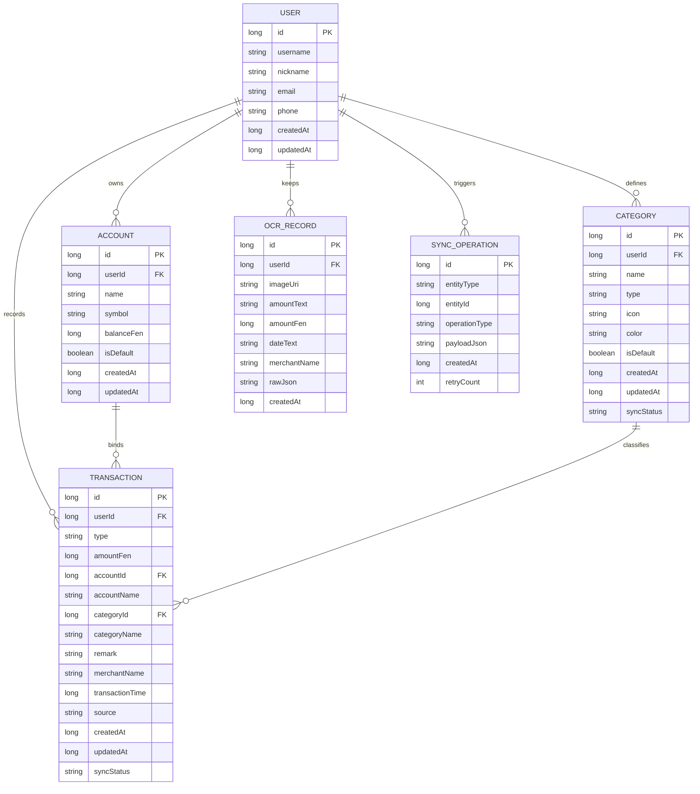

## 9. 总体架构分析

## 9.1 架构分层说明

客户端采用典型 MVVM 分层：

- UI 层：Fragment、BottomSheetDialogFragment、Adapter
- 表现层：ViewModel
- 领域编排层：Repository
- 数据层：Room / DataStore / Retrofit / OCR Engine

后端采用轻量分层：

- Controller：对外 API 和后台页面入口
- Interceptor：Token 校验与后台登录拦截
- Store：内存型业务数据中心
- Thymeleaf：后台页面渲染

## 9.2 总体架构图

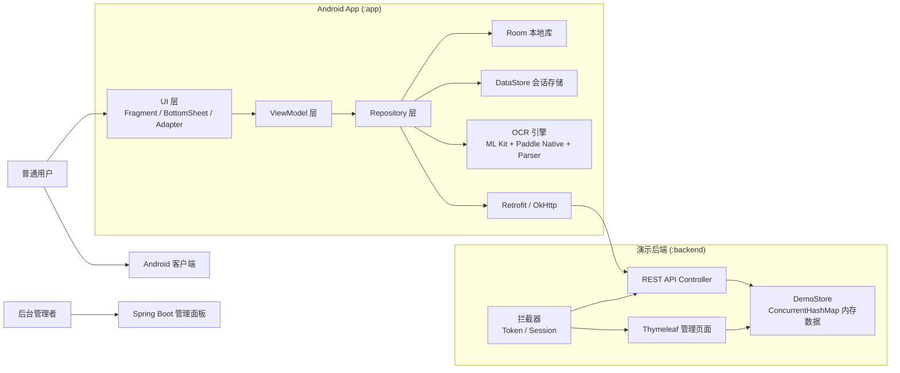

## 9.3 核心类图

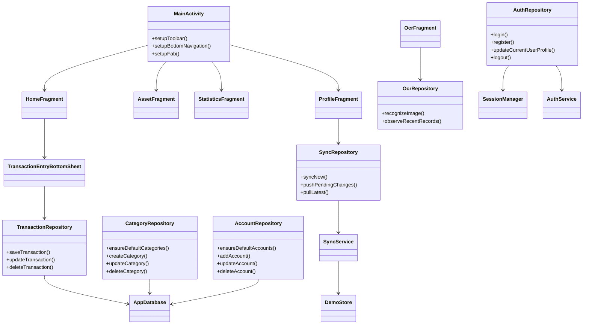

## 10. 用例分析

## 10.1 普通用户用例图

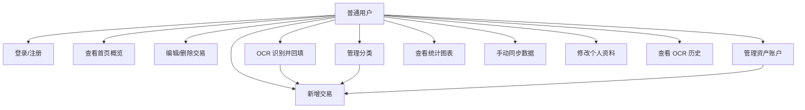

## 10.2 后台管理者用例图

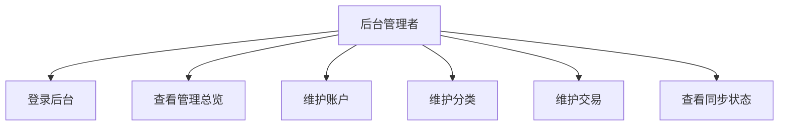

## 11. 核心业务流程分析

## 11.1 登录流程

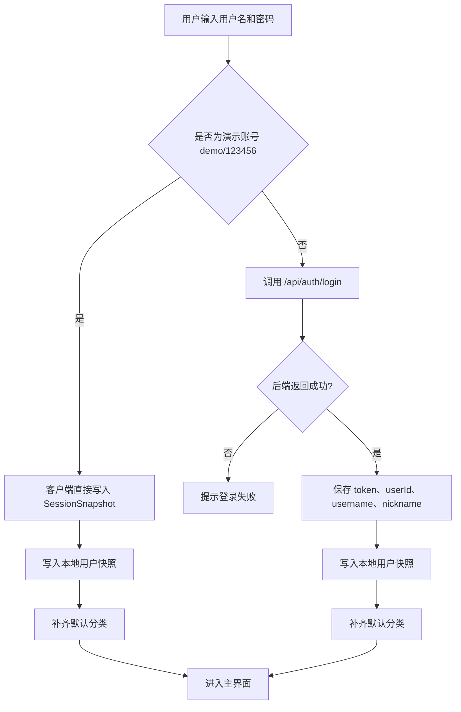

## 11.2 新增记账流程

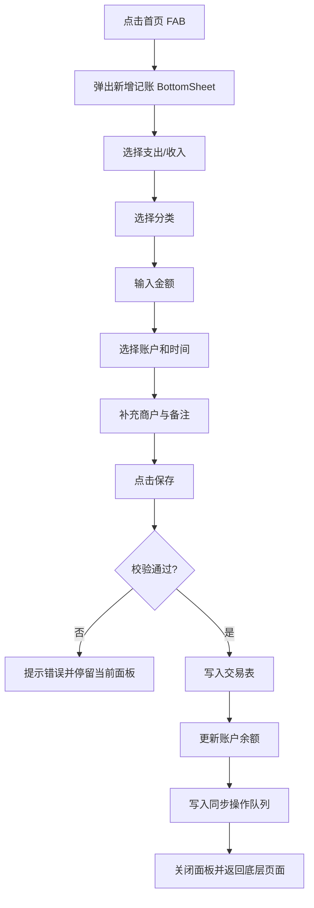

## 11.3 OCR 识别流程

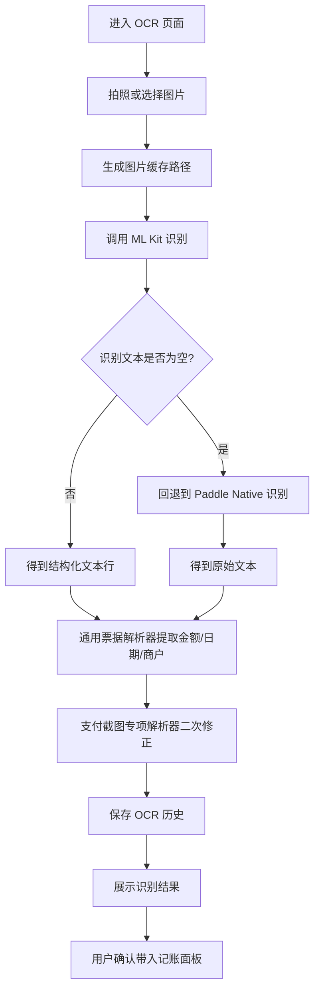

## 11.4 同步流程

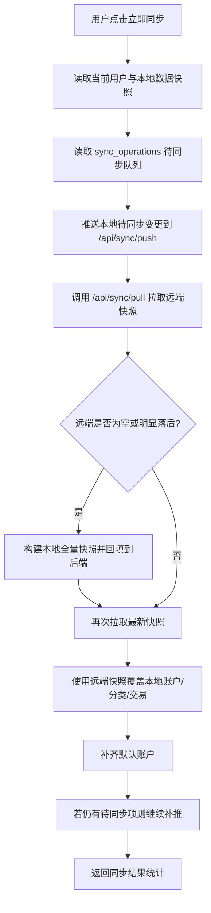

## 12. 时序图

## 12.1 OCR 识别并记账时序图

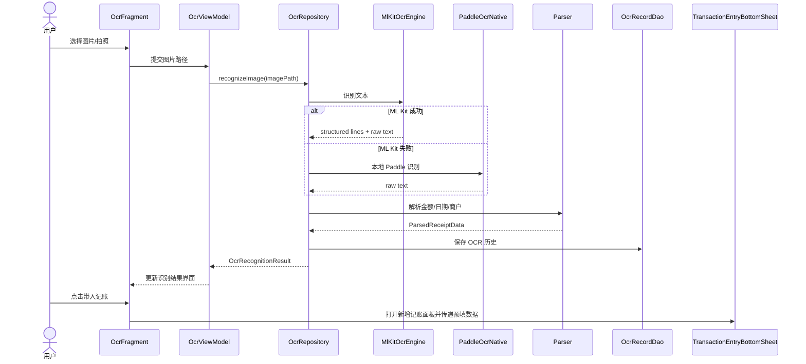

## 12.2 手动同步时序图

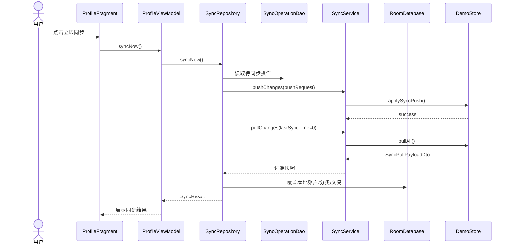

## 13. 接口需求分析

## 13.1 客户端调用的后端 API

### 13.1.1 认证接口

| 方法 | 路径 | 说明 |
| --- | --- | --- |
| POST | `/api/auth/register` | 注册 |
| POST | `/api/auth/login` | 登录 |
| GET | `/api/user/me` | 获取当前用户 |
| PUT | `/api/user/me` | 更新当前用户 |

### 13.1.2 账户接口

| 方法 | 路径 | 说明 |
| --- | --- | --- |
| GET | `/api/accounts` | 查询账户列表 |
| POST | `/api/accounts` | 新增账户 |
| PUT | `/api/accounts/{id}` | 编辑账户 |
| DELETE | `/api/accounts/{id}` | 删除账户 |

### 13.1.3 分类接口

| 方法 | 路径 | 说明 |
| --- | --- | --- |
| GET | `/api/categories` | 查询分类列表 |
| POST | `/api/categories` | 新增分类 |
| PUT | `/api/categories/{id}` | 编辑分类 |
| DELETE | `/api/categories/{id}` | 删除分类 |

### 13.1.4 交易接口

| 方法 | 路径 | 说明 |
| --- | --- | --- |
| GET | `/api/transactions` | 查询交易列表，可带起止时间和类型 |
| POST | `/api/transactions` | 新增交易 |
| PUT | `/api/transactions/{id}` | 编辑交易 |
| DELETE | `/api/transactions/{id}` | 删除交易 |

### 13.1.5 同步接口

| 方法 | 路径 | 说明 |
| --- | --- | --- |
| POST | `/api/sync/push` | 上传本地变更 |
| POST | `/api/sync/pull` | 拉取远端快照 |

## 13.2 后台页面路由

| 方法 | 路径 | 说明 |
| --- | --- | --- |
| GET | `/manage/login` | 后台登录页 |
| POST | `/manage/login` | 后台登录提交 |
| POST | `/manage/logout` | 后台退出 |
| GET | `/manage/dashboard` | 管理总览 |
| GET | `/manage/accounts` | 账户管理页 |
| POST | `/manage/accounts/save` | 保存账户 |
| POST | `/manage/accounts/delete` | 删除账户 |
| GET | `/manage/categories` | 分类管理页 |
| POST | `/manage/categories/save` | 保存分类 |
| POST | `/manage/categories/delete` | 删除分类 |
| GET | `/manage/transactions` | 交易管理页 |
| POST | `/manage/transactions/save` | 保存交易 |
| POST | `/manage/transactions/delete` | 删除交易 |
| GET | `/manage/sync` | 同步状态页 |

## 13.3 统一响应要求

后端 REST 接口统一使用 `ApiResponse<T>` 作为返回结构，至少包含：

- `code`
- `msg`
- `data`

客户端对 `code != 0` 的响应统一视为业务失败，需要给出用户可理解的错误提示。

## 14. 关键业务规则汇总

### 14.1 账户与交易联动规则

- 收入记账会增加账户余额。
- 支出记账会减少账户余额。
- 编辑交易时需要先回滚旧余额影响，再应用新余额影响。
- 删除交易时需要撤销对账户的余额变更。

### 14.2 分类管理规则

- 分类具有收入/支出类型边界。
- 交易类型必须与所选分类类型一致。
- 删除分类后，历史交易需要转移到兜底分类，不能出现悬空交易。

### 14.3 同步规则

- 本地优先，不阻塞用户当前操作。
- 同步对象仅限账户、分类、交易和用户资料相关信息。
- OCR 历史不进入远端同步。
- 后端管理页操作后，客户端需主动同步才能拉到最新结果。

### 14.4 OCR 规则

- OCR 识别结果只作为预填建议。
- 用户必须保有手动修改能力。
- 支付截图识别优先考虑“实付/合计/支付金额”等更贴近真实付款值的候选金额。

## 15. 非功能需求分析

## 15.1 可用性

- 主要业务必须在真机上顺畅完成。
- 新增记账应尽量缩短步骤，减少跳页。
- 页面结构需符合 Material Design 使用习惯。

## 15.2 可维护性

- 客户端采用 MVVM + Repository，模块边界清晰。
- 后端接口分 Controller，核心数据规则收敛到 `DemoStore`。
- 技术栈主流，适合毕业设计后续答辩与讲解。

## 15.3 可扩展性

- 后端未来可将 `DemoStore` 替换为 MySQL 持久化实现。
- OCR 未来可继续补充更多支付截图模板和票据规则。
- 统计模块未来可增加更多维度，如账户统计、分类排行、预算对比等。

## 15.4 离线能力

- 客户端记账、分类、资产、统计依赖本地 Room，可离线运行。
- 后端不可用时，演示账号仍可完成大部分前端功能体验。

## 15.5 安全性

当前项目安全性定位为本地演示级：

- 用户密码采用 BCrypt 哈希。
- API 通过 Bearer Token 区分用户。
- 后台面板通过 Session 拦截访问。

但以下能力尚未作为当前核心目标：

- 细粒度权限模型
- 刷新 Token 体系
- 数据库级审计
- 公网部署防护

## 16. 当前实现与后续生成建议

如果后续希望让其他大模型继续扩展本项目，建议把以下内容作为固定前置输入：

- 本项目是 Android Kotlin + Spring Boot 多模块 Gradle 工程，不是 Vue Web 项目。
- Android 客户端是主系统，后端仅用于本地同步演示和后台维护。
- OCR 当前采用端侧识别链路：ML Kit 优先，Paddle Native 回退，Parser 负责业务字段提取。
- 同步采用本地优先策略，客户端通过 `sync_operations` 记录待同步变更。
- 后端当前使用内存型 `DemoStore`，不是 MySQL 持久化实现。
- 交易、分类、账户之间存在明确联动规则，扩展时不能破坏余额回滚、分类兜底和同步队列逻辑。

## 17. 结论

从当前源码来看，小记OCR记账已经不是单纯的“本地记账 Demo”，而是一个结构较完整的移动端账本系统。它具备用户认证、首页账本、底部弹层记账、资产管理、分类管理、OCR 智能录入、统计分析、后端同步和后台管理等完整功能链路。

如果后续继续扩展，优先建议沿着以下方向推进：

- 将后端内存存储替换为真实数据库。
- 完善同步冲突处理与增量拉取能力。
- 丰富 OCR 规则模板和异常兜底体验。
- 补充更系统的单元测试与集成测试。

在当前阶段，这份需求分析文档已经可以作为后续开发、论文整理或大模型生成代码的高质量输入基线。
